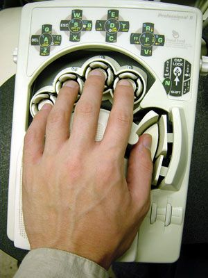

keybrd library for creating keyboard firmware
=============================================
keybrd library is an open source library for creating custom-keyboard firmware.
The keybrd library allows keyboard designers to develop and publish their firmware simply as possible.

keybrd library supports any keyboard configuration:
* one-piece
* split with shift registers
* split with I/O expander
* single-layer
* multiple-layer
* LED indicator lights

Multiple-layer keyboards can write symbols without using the shift key:

    ~ ! @ # $ % ^ & * () _ {} | < > : ?

keybrd library leverages the Arduino environment to create keyboard firmware.
The Arduino development environment is free, and easy for novice programmers to setup and learn.

The keybrd library has been tested on Teensy LC, Teensy 2.0, 74HC165 shift registers, and PCA9655E I/O expander.
The resulting keyboard firmware is compatible with standard USB keyboard drivers.

> The keybrd library is in Beta testing.  The public API should not be considered stable.

Example minimal keybrd sketch
-----------------------------
A [minimal keybrd sketch](/tutorials/keybrd_1_breadboard/keybrd_1_breadboard.ino)
is 40 lines of code for a 4-key keyboard.
The sketch is small because the keybrd library takes care of the low-level details.
It runs the breadboard keyboard in this picture.

Example complex keybrd sketch
-----------------------------
keybrd_DH and its instantiation files contain about 800 lines of code.
It emulates the DataHand keyboard.
The layout has 52 keys, 4 layers, 6 sub-layers, 2 matrices, 8 LEDs, and blinking LEDs.

[keybrd_DH_library_developer_guide.md](https://github.com/wolfv6/keybrd_DH/blob/master/doc/keybrd_DH_library_developer_guide.md) 
[mainSketch.ino](https://github.com/wolfv6/keybrd_DH/blob/master/examples/keybrd_DH/mainSketch.cpp) 
[instantiations_pins.h](https://github.com/wolfv6/keybrd_DH/blob/master/src/instantiations_pins.h) 
[instantiations_scancodes.h](https://github.com/wolfv6/keybrd_DH/blob/master/src/instantiations_scancodes.h) 
[instantiations_layercodes.h](https://github.com/wolfv6/keybrd_DH/blob/master/src/instantiations_layercodes.h) 
[instantiations_rows_L.h](https://github.com/wolfv6/keybrd_DH/blob/master/src/instantiations_rows_L.h) 
[instantiations_rows_R.h](https://github.com/wolfv6/keybrd_DH/blob/master/src/instantiations_rows_R.h)

Support
-------
[Guides](doc) and [tutorials](tutorials) are provided.

keybrd tutorial_1 shows how to build a breadboard keyboard.
The remaining [keybrd tutorials](tutorials) show how to create custom keybrd firmware.

Please ask questions in [keybrd firmware library](geekhack todo) thread if something is not clear.
