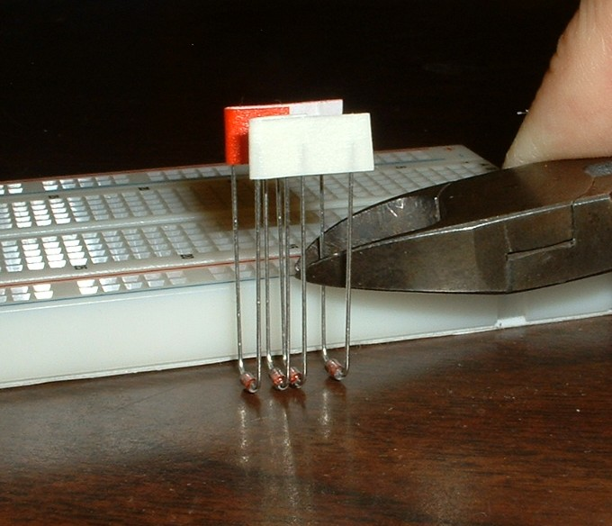
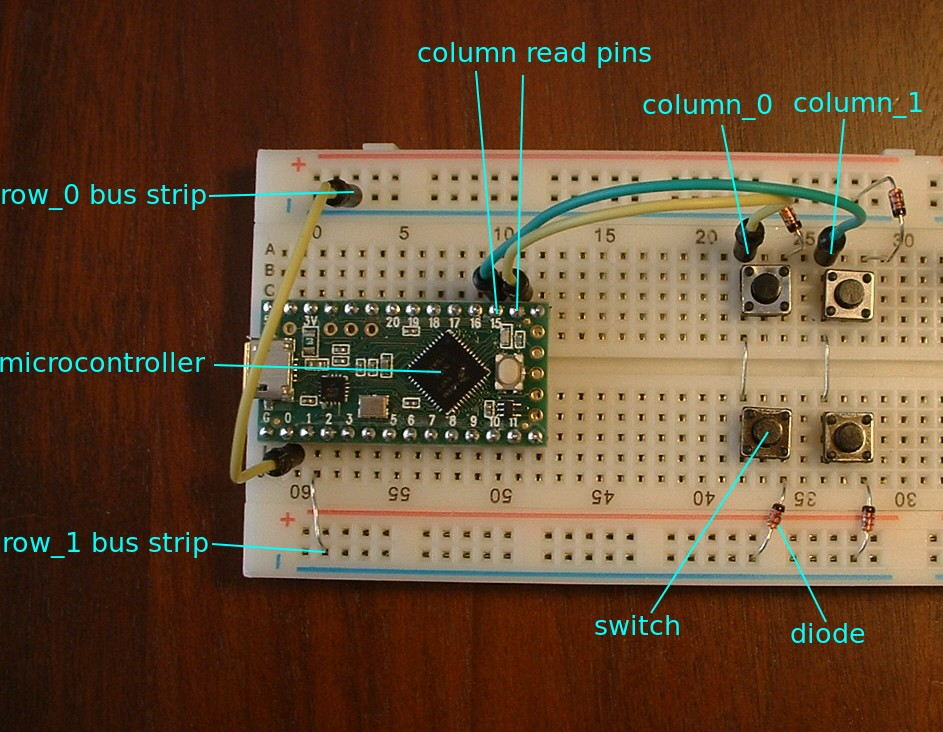

Tutorial 1 - breadboard keyboard
================================
In this tutorial, you will build a breadboard keyboard with 4 keys.
The keyboad will be used in tutorials 2 through 7.

When you finish this tutorial you will have a working keyboard and an understanding of how a key matrix works.

Why a solderless breadboard keyboard is useful
----------------------------------------------
Breadboard keyboards have key matrices and diodes just like the big keyboards.

A breadboard is the easiest way to learn keyboard electronics.
Learning is fun when mistakes are easily corrected.
Compared to PCBs, breadboard keyboards make learning faster because:
* Mistakes are easily corrected; no soldering and desoldering
* Parts can be reused in many different configurations
* A small keyboard is easier to trouble shoot

Breadboard keyboards are useful for:
* learning keyboard electronics - microcontroller, key matrix, diode, shift registers, I/O expander
* learning the keyboard-development workflow
* prototyping circuits before making a PCB

Breadboard keyboard starter kit
-------------------------------
The parts needed to build the tutorial breadboard keyboards are listed in [breadboard_keyboard_supplies.ods](breadboard_keyboard_supplies.ods).

The tutorials use a Teensy LC controller, but any Arduino-compatible controller with at least 2 KB SRAM should work.

You will need two tools:
* Wire cutters
* A multi-meter for trouble shooting

Wire striper, lead-forming tool, and Anti-static mat are optional.

How a breadboard works
----------------------
To understand the breadboard keyboard you will need to know the internal parts of a breadboard:
* bus strip
* terminal strip

These are explained in [How to Use a Breadboard](https://learn.sparkfun.com/tutorials/how-to-use-a-breadboard)

Electrostatic discharge (ESD) safety
------------------------------------
Static electricity can damage a ICs in ways that are hard to trouble shoot.

Here is a ESD precaution for handling ICs:

1. Touch the bare metal on the back of my desktop computer (its grounded).
2. Then touch the IC or circuit (if its a micro-controller, touch the metal USB connector case).

I take these ESD precaution because I live in a dry environment on a carpeted floor.
Not everyone needs to take ESD precautions:
* http://forum.arduino.cc/index.php?topic=4643.0
* https://forums.adafruit.com/viewtopic.php?f=8&t=12128

Anti-static mat or anti-static wristband are also effective.
But being tethered by an anti-static wristband can be inconvenient (wireless antistatic wrist straps are a scam).

Building a basic breadboard keyboard
------------------------------------
The basic breadboard keyboard has 4 switches.

A Teensy LC microcontroller is on the left.
A key matrix with 4 switches is to the right.

The key matrix has two two columns.
Short wires connect terminal strips into matrix columns.
Jumper wires connect the columns to the microcontroller.

Two bus strips are used as matrix rows.
A jumper connects the top row to the microcontroller.
A short wire connects the bottom row to the microcontroller.

A switches and diodes connect rows to columns.

Tutorials 2 and 3 use the same basic breadboard keyboard pictured above.
Tutorials 4, 5, and 6 add more components to the basic breadboard keyboard.
Positioning components as shown in the picture will provide space for those components.

Breadboard keyboard assembly instructions:

1. Shape leads to fit breadboard.
  * cut tactile-switch leads to length
  * bend and cut diode leads (save the cut offs for steps 2, 3, and tutorial 4)

 

 

2. Insert parts into the breadboard as shown in the picture.
  * The breadboard is oriented with the red bus strips on top and blue bus strips on the bottom
   (this is important because tutorials will refer to the "red bus" and the "blue bus")
  * Teensy LC is on the left
  * switch leads are oriented to connect diodes to columns (pictured below)
  * diode cut offs connect terminal strips into columns
  * diodes connect switches to rows; orient diodes with cathode (banded end) towards the rows (blue bus)

 

 

3. Insert jumper wires to connect Arduino pins to the matrix rows and columns.
  * refer to the [Teensy LC pinout diagram](https://www.pjrc.com/teensy/card6a_rev2.png).
  * row_0 is the top row, and col_0 is the left column

| Pin number | Connects to |
|------------|-------------|
|  0         | row_0       |
|  1         | row_1       |
| 14         | col_0       |
| 15         | col_1       |

Compiling and loading the keyboard firmware
-------------------------------------------
Follow the [keybrd Library User's Guide](../doc/keybrd_library_user_guide.md) to set up the Arduino environment.

Compile and load the [keybrd_1_breadboard.ino](/tutorials/keybrd_1_breadboard/keybrd_1_breadboard.ino) sketch into the keyboard's controller.
The operating system will take 1 to 6 seconds to recognize the USB keyboard.
Then pressing the keys should type the characters 1, 2, a, b.
Congratulations, you have a working keyboard.

How a key matrix works
----------------------
Now we fill in some details of how it all works.

This excellent article explains how key matrix, diodes, and ghosting work:
[How a Key Matrix Work](http://pcbheaven.com/wikipages/How_Key_Matrices_Works/)

In the article:

> Output pins power columns and input pins detect the power on rows.

The breadboard keyboards in this series of tutorials do it the other way:

> Output pins power rows and input pins detect the power on columns.

The keybrd library uses the word "strobe", which means powering one row for a very short time.
Strobe pins are output pins connected to rows.
One row at a time is strobed.
While a row is strobed, input pins connected to the columns sense which buttons are pressed.

Exercises
---------
1) replace the diodes with wires (cutoffs) and intentionally cause ghosting.

 
 keybrd tutorial by <a xmlns:cc="https://creativecommons.org/ns" href="https://github.com/wolfv6/keybrd" property="cc:attributionName" rel="cc:attributionURL">Wolfram Volpi</a> is licensed under a <a rel="license" href="https://creativecommons.org/licenses/by/4.0/">Creative Commons Attribution 4.0 International License</a>. Permissions beyond the scope of this license may be available at <a xmlns:cc="https://creativecommons.org/ns" href="https://github.com/wolfv6/keybrd/issues/new" rel="cc:morePermissions">https://github.com/wolfv6/keybrd/issues/new</a>.
