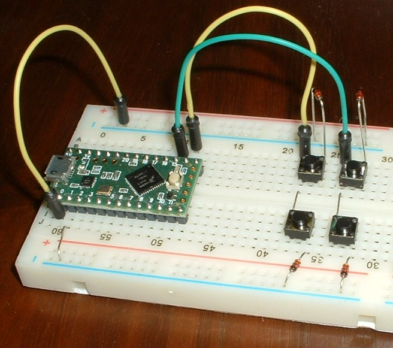

Tutorial 3b - autoShift
=======================
Some multi-layer keyboards have a symbols layer that writes symbols without using the shift key:

    ~ ! @ # $ % ^ & * () _ {} | < > : ?

The keybrd library does this by automatically sending a MODIFIERKEY_SHIFT scancode.

Two keybrd classes use AutoShift:
* Code_ScS
* Code_ScNS

The [keybrd_3b_autoShift.ino](keybrd_3b_autoShift/keybrd_3b_autoShift.ino) sketch explains the AutoShift feature.
It will run on the basic breadboard keyboard described in [tutorial_1_breadboard_keyboard.md](tutorial_1_breadboard_keyboard.md).
After reading the sketch you too will be able to automatically shifted characters.

Exercises
---------
1) Modify the keybrd_3b_autoShift sketch to make a 3-layer keyboard with a default layer and two Code_LayerHold objects.

| Layout | **0** | **1** |
|:------:|:-----:|:-----:|
|  **0** | a ! 6 | b @ 7 |
|  **1** |  sym  |  num  |

 
 keybrd tutorial by <a xmlns:cc="https://creativecommons.org/ns" href="https://github.com/wolfv6/keybrd" property="cc:attributionName" rel="cc:attributionURL">Wolfram Volpi</a> is licensed under a <a rel="license" href="https://creativecommons.org/licenses/by/4.0/">Creative Commons Attribution 4.0 International License</a>. Permissions beyond the scope of this license may be available at <a xmlns:cc="https://creativecommons.org/ns" href="https://github.com/wolfv6/keybrd/issues/new" rel="cc:morePermissions">https://github.com/wolfv6/keybrd/issues/new</a>.
