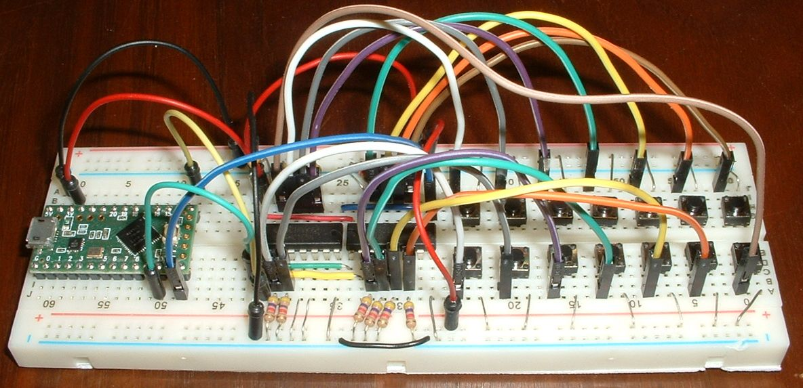
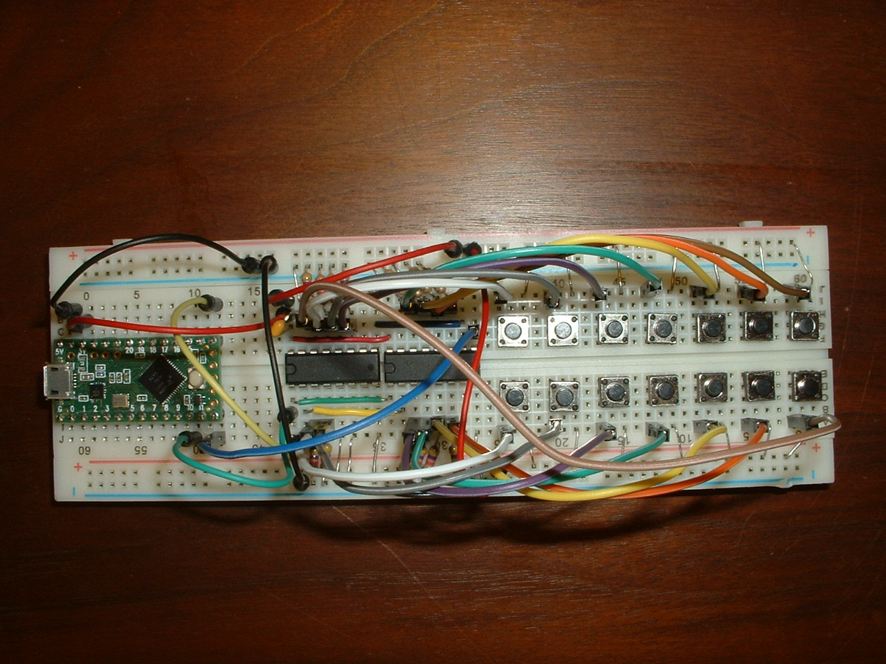
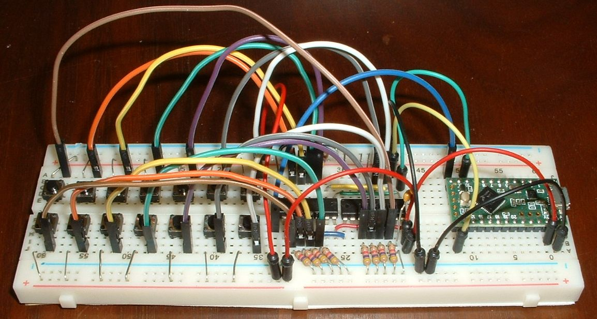

keybrd Tutorial 4b - split keyboard with shift registers
========================================================
When you finish this tutorial you will be able to be able to modify a split keybrd sketch with 10 to 24 keys on the shift registers.

Overview of split keyboard with shift registers
------------------------------------------------
The breadboard in the following picture models a split keyboard.
The green rectangle on the left is a Teensy LC micro controller.
The black rectangles in the middle are two SN74HC165N shift registers daisy chained together.
The micro controller and shift registers are connected via 5 jumper wires.

Only the right matrix is shown.  The left matrix is not needed for this demonstration and was omitted to reduce clutter.

The right-matrix layout has 2 rows and 7 columns.
Electronically, there is only one row of keys.
Diodes are not needed because there is only one row.



Building a split breadboard keyboard with shift registers
---------------------------------------------------------
Add components to the breadboard as shown in the picture.
Refer to the SN74HC165N datasheet to locate its pins.

In the picture, SN74HC165N pin 1s are on the left end, towards the controller.
Shift registers are chained together by colored wires that lay flat on the breadboard.

Each shift register has 8 parallel input pins, 4 on each side.
14 input pins and their keys are connected to 10k pull-down resistor which are grounded (blue bus).
2 input pins are not used, they are grounded (blue bus).

Switches are connected to power (red bus) and shift register input pins (jumpers).

This table lists what gets connected to the 74HC165 pins:

```
74HC165 left (lower half of breadboard)
NAME    PIN# DESCRIPTION         TO TEENSY LC PIN#  CHAIN
SH/LD   1    shift or load input CS0   10           green wire
CLK     2    clock input         SCK0  13           yellow wire
 D4     3    parallel input
 D5     4    parallel input
 D6     5    parallel input
 D7     6    parallel input
/QH     7    ~serial output
GND     8    ground              gnd                blue bus

74HC165 right (upper half of breadboard)
NAME    PIN# DESCRIPTION         TO TEENSY LC PIN#  CHAIN
VCC     16   power pin           3.3V               red wire
CLK INH 15   clock inhibit                          blue bus
 D3     14   parallel input
 D2     13   parallel input
 D1     12   parallel input
 D0     11   parallel input
SER     10   serial input                           blue wire to next QH
 QH      9   serial output       MISO0 12           blue wire to previous SER

```





A decoupling capacitor between the power and ground wires suppresses noise.

I apologize for not providing a schematic.

Sketch for split keyboard with shift registers
----------------------------------------------
[keybrd_4b_split_keyboard_with_shift_registers.ino](keybrd_4b_split_keyboard_with_shift_registers/keybrd_4b_split_keyboard_with_shift_registers.ino) is a simple sketch with two shift registers.
It will run on the above breadboard keyboard.

Exercises
---------
1. Guess what happens if an unused input pin is not grounded?  Try it.

<br>
<a rel="license" href="https://creativecommons.org/licenses/by/4.0/"></a><br /><span xmlns:dct="http://purl.org/dc/terms/" property="dct:title">keybrd tutorial</span> by <a xmlns:cc="https://creativecommons.org/ns" href="https://github.com/wolfv6/keybrd" property="cc:attributionName" rel="cc:attributionURL">Wolfram Volpi</a> is licensed under a <a rel="license" href="https://creativecommons.org/licenses/by/4.0/">Creative Commons Attribution 4.0 International License</a>.<br />Permissions beyond the scope of this license may be available at <a xmlns:cc="https://creativecommons.org/ns" href="https://github.com/wolfv6/keybrd/issues/new" rel="cc:morePermissions">https://github.com/wolfv6/keybrd/issues/new</a>.
