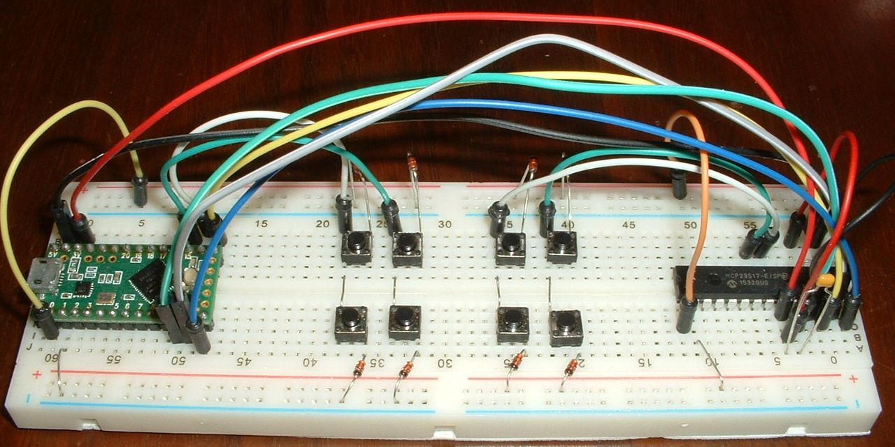

keybrd Tutorial 4c - split keyboard with I/O Expander
====================================================
When you finish this tutorial you will be able to be able to modify a 2-matrix keybrd sketch to suite your own split keyboard design.

Overview of split keyboard with I/O Expander
--------------------------------------------
The breadboard in the following picture models a split keyboard.
The green rectangle on the left is a Teensy LC micro controller.
The black rectangle on the right is a MCP23S17 I/O expander.

The two ICs communicates via SPI protocol, where Teensy LC is the master and MCP23S17 is slave.
The two ICs are connected via six jumper wires.

The breadboard's four bus strips are used as matrix rows.
Two rows (blue buses) are connected to the microcontroller.
Two rows (red buses) are connected to the I/O expander.

I/O expanders
-------------
The MCP23S17 I/O expander has two ports with 8 I/O pins each.
I/O expander input/output pins are connected to a switch matrix.
Port B strobes one row at a time.
Port A reads the columns.

SPI and I2C communication protocols
-----------------------------------
SPI and I2C are popular communication protocols.
Either one can be used to connect split keyboards.

I2C is fast enough for scanning up to 5 rows.
The keybrd_DH (DodoHand) sketch polls 5 rows over I2C at 7.5ms per keyboard scan.

SPI is much faster, but requires 2 additional wires.
Use SPI if your key matrix has more then 5 rows.

| connection type        | controller pins | wire count |
|------------------------|:---------------:|:----------:|
| I/O expander SPI       | 4               | 6          |
| I/O expander I2C       | 2               | 4          |

The example in this tutorial uses the SPI protocol.

Building a split keyboard with I/O Expander
-------------------------------------------
Starting with the basic breadboard keyboard described in [tutorial_1_breadboard_keyboard.md](tutorial_1_breadboard_keyboard.md), add parts as described above.
Refer to the MCP23S17 datasheet to locate its pins.

In the picture, MCP23S17 pin 1 is on the left end, towards the controller.

The MCP23S17 I/O expander has two ports.  Each port has eight pins.
Port B is connected to the matrix's rows (red bus).
Port A is connected to the matrix's columns (jumpers).

MCP23S17's device address is configured by hardware pins.
All three address pins are grounded.

The MCP23S17's /RESET pin is connected to VDD.

This table lists the six wires connecting Teensy LC to MCP23S17:

|CONNECTION          |Teensy LC|MCP23S17|
|:------------------:|---------|--------|
|ground              | GND     | VSS    |
|power               | 3.3v    | VDD    |
|Serial Clock        | SCK0    | SCK    |
|Master Out, Slave In| MOSI0   | SI     |
|Master In, Slave Out| MISO0   | SO     |
|Chip Select         | CS0     | /CS    |

A decoupling capacitor between the power and ground wires suppresses noise.

<!-- todo schematic with IOE power decoupling capacitor
This schematic was written by consulting the I/O expander's datasheet and using the ?? tool. -->

Sketch for split keyboard with I/O Expander
-------------------------------------------
The [keybrd_4c_split_with_IOE.ino](keybrd_4c_split_with_IOE/keybrd_4c_split_with_IOE.ino)
 sketch explains how the I/O Expander works on a keyboard.

 keybrd tutorial by <a xmlns:cc="https://creativecommons.org/ns" href="https://github.com/wolfv6/keybrd" property="cc:attributionName" rel="cc:attributionURL">Wolfram Volpi</a> is licensed under a <a rel="license" href="https://creativecommons.org/licenses/by/4.0/">Creative Commons Attribution 4.0 International License</a>. Permissions beyond the scope of this license may be available at <a xmlns:cc="https://creativecommons.org/ns" href="https://github.com/wolfv6/keybrd/issues/new" rel="cc:morePermissions">https://github.com/wolfv6/keybrd/issues/new</a>.
