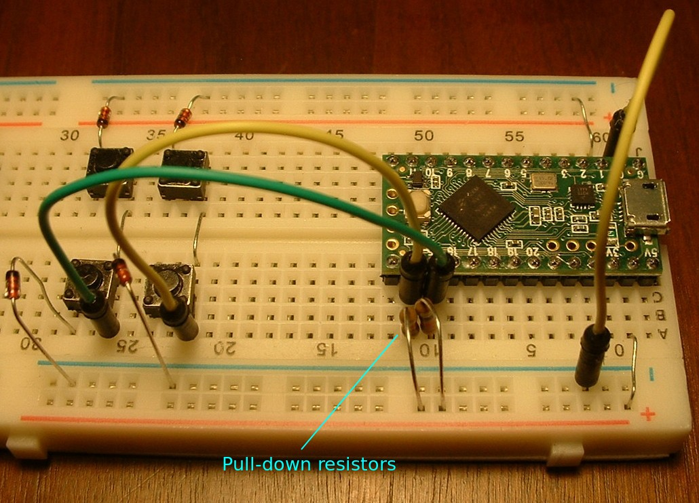

Tutorial 6 - Active high
========================

Pull-up resistors
-----------------
There are many sources that explain "pull-up resistors", so I won't repeat it here.
Here is a [good tutorial on Pull-up Resistors](https://learn.sparkfun.com/tutorials/pull-up-resistors/what-is-a-pull-up-resistor).

Active low
----------
Most the keyboards up to this point in the tutorial series have used active low with internal pull-up resistors.

"Active low" means that if a switch is pressed (active state), the read pin is low.
When the switch is released (inactive state), the pull-up resistor pulls the read pin high.

Arduino boards have internal pull-up resistors, which saves on parts and labor compared to manually adding external pull resistors.

To make a key matrix active low:
* Orient diodes with cathode (banded end) towards the strobe pins (row)
* Instantiate the scanner in the sketch with strobeOn LOW, like this:
```
Scanner_uC scanner(LOW, readPins, readPinCount);
```

Active high
-----------
"Active high" means that if a switch is pressed (active), the read pin is high.
When the switch is released (inactive), the pull-down resistor pulls the read pin low.

Arduino boards do not have internal pull-down resistors.
If you want to use active low, you will have to add external pull-down resistors to the read pins.

To make a key matrix active high:
* Add an external 10k Ohm pull-down resistor to each read pin
* Orient diodes with cathode (banded end) towards the read pins
* Instantiate the scanner in the sketch with strobeOn HIGH, like this:
```
Scanner_uC scanner(HIGH, readPins, readPinCount);
```

Making a breadboard keyboard active-high
----------------------------------------
Make the following changes to the basic breadboard keyboard described in [tutorial_1_breadboard_keyboard.md](tutorial_1_breadboard_keyboard.md):
* Add an external 10k Ohm pull-down resistor (red bus) to each read pin
* Orient diodes with cathode (banded end) towards the read pins



keybrd sketch with active-high
------------------------------
The [keybrd_6_active_high.ino](keybrd_6_active_high/keybrd_6_active_high.ino) sketch will run on the above breadboard keyboard.

<br>
<a rel="license" href="https://creativecommons.org/licenses/by/4.0/"></a><br /><span xmlns:dct="http://purl.org/dc/terms/" property="dct:title">keybrd tutorial</span> by <a xmlns:cc="https://creativecommons.org/ns" href="https://github.com/wolfv6/keybrd" property="cc:attributionName" rel="cc:attributionURL">Wolfram Volpi</a> is licensed under a <a rel="license" href="https://creativecommons.org/licenses/by/4.0/">Creative Commons Attribution 4.0 International License</a>.<br />Permissions beyond the scope of this license may be available at <a xmlns:cc="https://creativecommons.org/ns" href="https://github.com/wolfv6/keybrd/issues/new" rel="cc:morePermissions">https://github.com/wolfv6/keybrd/issues/new</a>.
